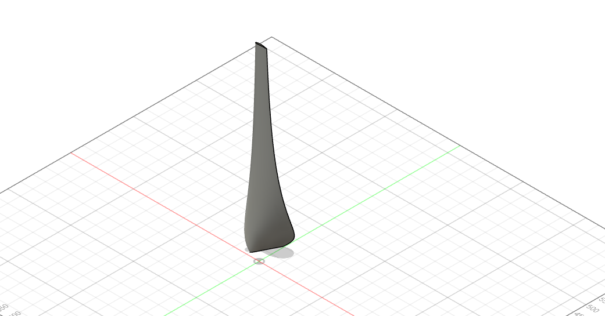

# YBlade (Lasercutting) - QBlade to lasercutting svg

Simple script that takes [QBlade](https://http://www.q-blade.org/) blade description and
constructs the blade as lasercutting paths:

## Usage

First, use QBlade to design your blade. Then export the blade table and profile
data. Then adjust some variables in the script and run it.

See example input files in [bladeExample](bladeExample).

Two bodies are generated under the root component:

- the first body is the outside shell of the blade. It is created by a sweep
  operation, so the body is completely smooth.
- then there is the infill body (you can subtract from the shell). This body is
  created by loft operations and to reduce computational complexity, it is
  simplified.

## Known limitations

Currently, only blades with a single profile are supported.
